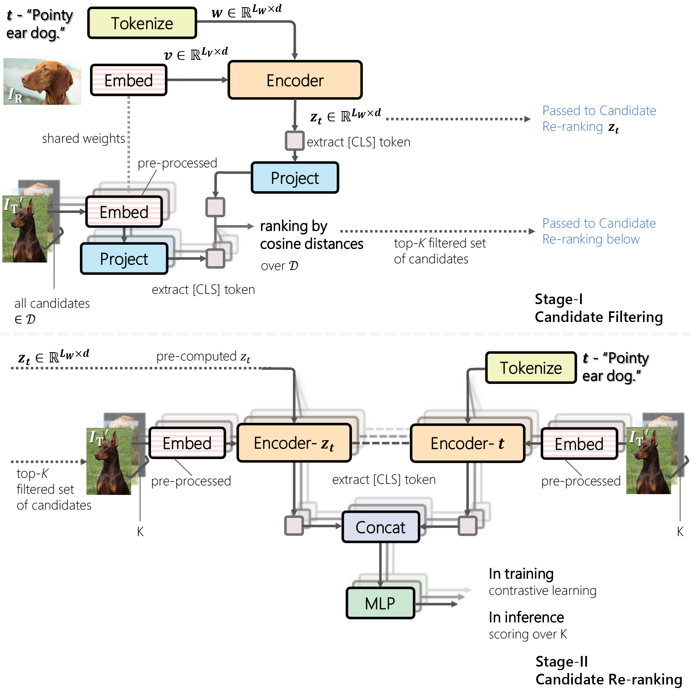

<div align="center">

## Candidate Set Re-ranking for Composed Image Retrieval

The official implementation for **Candidate Set Re-ranking for Composed Image Retrieval with Dual Multi-modal Encoder**.

##

<sup>Site navigation > [**Introduction**](#introduction) &nbsp;|&nbsp; [**Setting up**](#setting-up) &nbsp;|&nbsp; [**Usage**](#usage) &nbsp;|&nbsp; [**Citation**](#citation) </sup>


[-112467)](#)[^1]
[](https://openreview.net/forum?id=fJAwemcvpL)
[](https://arxiv.org/abs/2305.16304)


[](https://paperswithcode.com/sota/image-retrieval-on-fashion-iq?p=candidate-set-re-ranking-for-composed-image)
[](https://paperswithcode.com/sota/image-retrieval-on-cirr?p=candidate-set-re-ranking-for-composed-image)


</div>

[^1]: To be appeared, link will be updated shortly.

##

**News and upcoming updates**

- [x] **Jan-2024** Our paper has been accepted in TMLR.
- [x] **Jan-2024** Readme instructions released.
- [x] **Jan-2024** Code and pre-trained checkpoints released.


## Introduction

Our two-stage training pipeline is illustrated as follows.

Stage-I **candidate filtering** yields the top-K candidate list per query, which is then **re-ranked** in stage-II.

Here, stage-I is faster in inference, while stage-II is slower but much more discriminative.

<p align="center">
  
</p>

<details>
  <summary>Click to view the abstract</summary>
&emsp; 
Composed image retrieval aims to find an image that best matches a given multi-modal user query consisting of a reference image and text pair. Existing methods commonly pre-compute image embeddings over the entire corpus and compare these to a reference image embedding modified by the query text at test time.
Such a pipeline is very efficient at test time since fast vector distances can be used to evaluate candidates, but modifying the reference image embedding guided only by a short textual description can be difficult, especially independent of potential candidates.
An alternative approach is to allow interactions between the query and every possible candidate, i.e., reference-text-candidate triplets, and pick the best from the entire set. Though this approach is more discriminative, for large-scale datasets the computational cost is prohibitive since pre-computation of candidate embeddings is no longer possible.
We propose to combine the merits of both schemes using a two-stage model. Our first stage adopts the conventional vector distancing metric and performs a fast pruning among candidates. Meanwhile, our second stage employs a dual-encoder architecture, which effectively attends to the input triplet of reference-text-candidate and re-ranks the candidates. Both stages utilize a vision-and-language pre-trained network, which has proven beneficial for various downstream tasks.

&emsp; 
</details>

## Setting up

First, clone the repository to a desired location.

<details>
  <summary><b>Prerequisites</b></summary>
&emsp; 
	
The following commands will create a local anaconda environment with the necessary packages installed.

If you have worked with our previous codebase [Bi-BLIP4CIR](https://github.com/Cuberick-Orion/Bi-Blip4CIR), you can directly use its environment, as the required packages are identical.

```bash
conda create -n cirr_dev -y python=3.8
conda activate cirr_dev
pip install -r requirements.txt
```

&emsp; 
</details>

<details>
  <summary><b>Datasets</b></summary>
&emsp; 
	
Experiments are conducted on two standard datasets -- [Fashion-IQ](https://github.com/XiaoxiaoGuo/fashion-iq) and [CIRR](https://github.com/Cuberick-Orion/CIRR#download-cirr-dataset), please see their repositories for download instructions. 

The downloaded file structure should [look like this](https://github.com/ABaldrati/CLIP4Cir#data-preparation).

&emsp; 
</details>

<details>
  <summary><b>Optional:</b>  Set up Comet</summary>
&emsp; 
	
We use Comet to log the experiments. If you are unfamiliar with it, see [the quick start guide](https://www.comet.com/docs/v2/guides/getting-started/quickstart/). 

You will need to obtain an API Key for `--api-key` and create a personal workspace for `--workspace`. 

If these arguments are not provided, the experiment will be logged only locally.

&emsp; 
</details>

> [!NOTE]
> Our code has been tested on `torch 1.11.0` and `2.1.1`. Presumably, any version in between shall be fine.
> 
> Modify `requirements.txt` to specify your specific wheel of PyTorch+CUDA versions.
>
> Note that BLIP supports `transformers<=4.25`, otherwise errors will occur.


## Usage

The entire training & validation process involves the following steps:

 * **Stage 1**
   * training;
   * validating; extracting and saving the top-K candidate list (termed the "top-k file");
 * **Stage 2**
   * training;
   * validating;
   * (for CIRR) generating test split predictions for online submission.

See

 - [Step-by-step instruction on Fashion-IQ](Instructions_FashionIQ.md)

 - [Step-by-step instruction on CIRR](Instructions_CIRR.md)

All experiments are conducted using one NVIDIA A100, in practice, we observe the maximum VRAM usage to be around 70G (CIRR, stage II training).


> [!NOTE]
> To reproduce our reported results, please first download the checkpoints and top-k files and save them to paths noted in  [DOWNLOAD.md](DOWNLOAD.md).
>
> We provide all intermediate checkpoints and top-k files, so you could skip training steps and (for instance) develop directly on our Stage 2 model.

## Citation

If you find this code useful for your research, please consider citing our work.

```bibtex
@article{liu2023candidate,
    title     = {Candidate Set Re-ranking for Composed Image Retrieval with Dual Multi-modal Encoder},
    author    = {Liu, Zheyuan and Sun, Weixuan and Teney, Damien and Gould, Stephen},
    journal   = {arXiv preprint arXiv:2305.16304},
    year      = {2023}
}

@InProceedings{Liu_2024_WACV,
    author    = {Liu, Zheyuan and Sun, Weixuan and Hong, Yicong and Teney, Damien and Gould, Stephen},
    title     = {Bi-Directional Training for Composed Image Retrieval via Text Prompt Learning},
    booktitle = {Proceedings of the IEEE/CVF Winter Conference on Applications of Computer Vision (WACV)},
    month     = {January},
    year      = {2024},
    pages     = {5753-5762}
}
```

## License
MIT License applied. In line with licenses from [Bi-BLIP4CIR](https://github.com/Cuberick-Orion/Bi-Blip4CIR/blob/master/LICENSE), [CLIP4Cir](https://github.com/ABaldrati/CLIP4Cir/blob/master/LICENSE) and [BLIP](https://github.com/salesforce/BLIP/blob/main/LICENSE.txt).

## Acknowledgement

Our implementation is based on [BLIP4CIR](https://github.com/Cuberick-Orion/Bi-Blip4CIR), [CLIP4Cir](https://github.com/ABaldrati/CLIP4Cir) and [BLIP](https://github.com/salesforce/BLIP).

## Contact

 * Raise a new [GitHub issue](https://github.com/Cuberick-Orion/Candidate-Reranking-CIR/issues/new)
 * [Contact us](mailto:zheyuan.liu@anu.edu.au?subject=Regarding_Candidate-Reranking-CIR)
